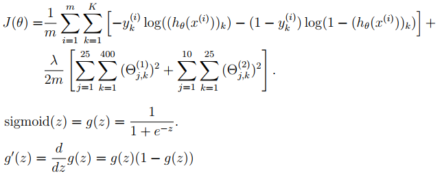
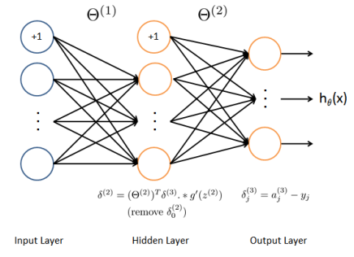

# Handwritten Digit Recognition using MLP

In this project, I have implemented one-vs-all logistic regression and neural networks (feedforward propagation and backpropagation) to recognize hand-written digits (from 0 to 9). Automated handwritten digit recognition is widely used today - from recognizing zip codes (postal codes) on mail envelopes to recognizing amounts written on bank checks.

**Regularized Logistic Regression**

We use a data set in *TrainingData.mat* that contains 5000 training examples of handwritten digits. The *.mat* format means that the data has been saved in a native MATLAB matrix format, instead of a text (ASCII) format like a csv-file. These matrices are read directly into the program by using the *load* command. After loading, matrices of the correct dimensions and values will appear in the program’s memory.
There are 5000 training examples in *TrainingData.mat*, where each training example is a 20 pixel by 20 pixel grayscale image of the digit. Each pixel is represented by a floating point number indicating the grayscale intensity at that location. The 20 by 20 grid of pixels is "unrolled" into a 400-dimensional vector. Each of these training examples becomes a single row in our data matrix **X**. This gives us a 5000 by 400 matrix **X** where every row is a training example for a handwritten digit image.
The second part of the training set is a 5000-dimensional vector **y** that contains labels for the training set. To make things more compatible with MATLAB indexing, where there is no zero index, we have mapped the digit zero to the value ten. Therefore, a "0" digit is labeled as "10", while the digits "1" to "9" are labeled as "1" to "9" in their natural order.

**Pre-trained Neural Network**

In the second part of the project, I have implemented a neural network to recognize handwritten digits using the same training set as before. The neural network will be able to represent complex models that form non-linear hypotheses. We will be using parameters from a neural network that we have already trained. Our goal is to implement the feedforward propagation algorithm to use our weights for prediction. 
Our neural network is shown in the figure below. It has 3 layers - an input layer, a hidden layer and an output layer. Our inputs are pixel values of digit images. Since the images are of size 20×20, this gives us 400 input layer units (excluding the extra bias unit which always outputs +1). As before, the training data will be loaded into the variables **X** and **y**.

We have a set of network parameters (Θ(1), Θ(2)) which are already trained. These are stored in *NNweights.mat* and will be loaded into **Theta1** and **Theta2**. The parameters have dimensions that are sized for a neural network with 25 units in the second layer and 10 output units (corresponding to the 10 digit classes).

**Backpropagation Algorithm for Neural Network Learning**

In the third part of the project, I have implemented the backpropagation algorithm for a neural network and applied it to the task of hand-written digit recognition using the same training set as before.
Our neural network is as same as before. It has 3 layers - an input layer, a hidden layer and an output layer. As before, our inputs are pixel values of digit images. Since the images are of size 20×20, this gives us 400 input layer units (not counting the extra bias unit which always outputs +1). The training data will be loaded into the variables **X** and **y**.
We have a set of network parameters (Θ(1), Θ(2)) which are already trained. These are stored in *NNweights.mat* and will be loaded into **Theta1** and **Theta2**. The parameters have dimensions that are sized for a neural network with 25 units in the second layer and 10 output units (corresponding to the 10 digit classes).

The intuition behind the backpropagation algorithm is as follows. Given a training example (x(t), y(t)), we will first run a "forward pass" to compute all the activations throughout the network, including the output value of the hypothesis *hΘ(x)*. Then, for each node in layer *l*, we would like to compute an "error term" *δ(l)* that measures how much that node was "responsible" for any errors in our output.
For an output node, we can directly measure the difference between the network’s activation and the true target value, and use that to define *δj(3)* (since layer 3 is the output layer). For the hidden units, we will compute *δ(l)* based on a weighted average of the error terms of the nodes in layer *(l+1)*.

In detail, here is the backpropagation algorithm (also depicted in the Figure). We should implement the steps mentioned above in a loop that processes one example at a time. Concretely, we should implement a for-loop **for t = 1:m** and place these steps inside the for-loop, with the *t-th* iteration performing the calculation on the *t-th* training example (x(t), y(t)). The final step will divide the accumulated gradients by m, and add the regularization term to obtain the gradients for the neural network cost function.
